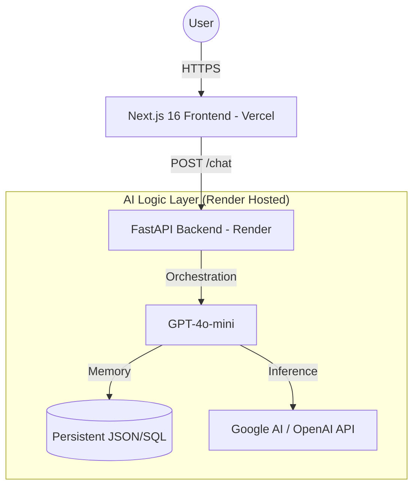

# Sami Rautanen - AI Engineer

**Building production-grade AI systems and autonomous agent architectures.**

---

## 🏗️ What I Build

I architect and implement **autonomous AI agent systems** end-to-end — from cloud infrastructure to production deployment. My focus is on systems that solve real business problems, not tutorials.

- 🤖 **Agentic Systems** — Multi-agent orchestration with CrewAI, LangGraph & MCP
- ☁️ **AWS Serverless** — Lambda, SQS, DynamoDB, S3 Vectors, Bedrock (Terraform managed)
- 🌐 **Full-Stack AI Apps** — Next.js 16 frontends backed by FastAPI agent pipelines

---

## 📊 Integrated Portfolio Architecture

The main portfolio site (samirautanen.fi) operates on a highly optimized Vercel/Render stack for performance and cost-efficiency:

---

## 🏆 Featured AI Agent Solutions

| Project                  | Status       | Stack                             | Description                                                                               |
| ------------------------ | ------------ | --------------------------------- | ----------------------------------------------------------------------------------------- |
| **Sidekick AI**          | ✅ **Live**   | LangGraph · HF · Python           | **Autonomy:** Browser-based agent architecture using worker-evaluator patterns.           |
| **Digital Twin (AWS)**   | ✅ **Live**   | Bedrock · DynamoDB · Terraform    | **Memory:** Multi-modal digital twin with long-term memory and AWS serverless infra.      |
| **EngineeringTeam Crew** | ✅ **Live**   | CrewAI · Claude 3.7 · GPT-4       | **Automation:** Full autonomous software team drafting, coding, and testing Python apps.  |
| **AgentSquad Platform**  | ✅ **Live**   | OpenAI SDK · Gemini · React       | **Intelligence:** Multi-agent platform for Sales pipelines and Deep Research.             |
| **Agentic Architect**           | 📦 **Open Source** | Next.js 16 · React Flow · Prisma  | **Architecture AI:** Interactive 4-tier system visualizer and automatic Prisma/API/UI code generator. |
| **Agentic Fullstack Template**  | 📦 **Open Source** | TypeScript · Python · CI/CD · OWASP | **Cognitive OS:** Studio-grade governance template & 17 skills for autonomous coding agents. |

---

## 🕹️ Gaming & Creative Logic

While my focus is on Enterprise AI, I have a deep history in systems thinking and logic through gaming:

- ♟️ **Yes Man Chess AI**: Stockfish-powered retro chess with personality-driven commentary and authentic CRT effects.
- 🎮 **[Indie Game Portfolio](https://sr3design.itch.io/)**: 10 published titles on Itch.io (Unity, C#, JS) exploring game AI, UI/UX, and complex logic patterns.
- 🃏 **Poker Analytics Engine**: Game simulation and probability visualization tool for decision analysis.

---

## 🛠️ Tech Stack

**AI & Agents**

**Cloud & Infrastructure**

**Frontend & Backend**

---

## 📊 Overview

- 🚀 **42 Repositories** — Autonomous agent systems, full-stack web apps, and game logic
- ⚡ **Core Focus** — Multi-agent orchestration, AWS serverless architectures, and end-to-end deployments
- 🛠️ **CI/CD Driven** — Automated production workflows via GitHub Actions and Terraform IaC

---

## 🤝 Connect

- **LinkedIn**: [Sami Rautanen](https://linkedin.com/in/sami-rautanen-022095325)
- **GitHub**: [@Samrude1](https://github.com/Samrude1)
- **Email**: samrude1@outlook.com
- **Website**: [samirautanen.fi](https://samirautanen.fi)

---
**AI Engineering & Cloud Architecture**
